<h1 align="center">Hi, I'm Muhammad Subhan 👋</h1>
<h3 align="center">Node JS Backend Developer</h3>

  
  

---

### 🚀 About Me

- 🎓 Currently pursuing a **BS in Information Technology** at Government College University, Faisalabad (2023 – 2027)
- 💻 Backend Developer experienced in building **RESTful APIs** with **Node.js, Express.js, MongoDB, and MySQL**
- 🏢 Gained hands-on experience as a **Backend Developer Intern** at Synergic Professionals Limited
- 🛠️ Built independent projects including a **multi-tenant SaaS platform** and an **e-commerce backend**
- 🌱 Always learning and improving real-world backend development and deployment workflows
- 🤝 Strong problem-solving skills, attention to detail, and proven ability to work independently and in teams

---

### 🧰 Tech Stack & Tools

**Languages & Frameworks :**

**Databases :**

**Cloud & Tools :**

**Concepts :**

`RESTful API Design` `JWT Authentication` `MVC Architecture` `Sequelize ORM` `Multi-Tenant Architecture`

---

### 📈 GitHub Stats

   

---

### 🎓 Education

- **BS Information Technology** — Government College University, Faisalabad (2023 – 2027) | CGPA: 3.12/4.0
- **FSc Pre-Engineering** — The Prime Standard College, Gojra (2020 – 2022)
- **Matriculation (Science)** — Govt. High School 278 JB, Gojra (2018 – 2020)

---

### 🌐 Languages

Urdu (Fluent) · Punjabi (Fluent) · English (Intermediate)

---

### 📫 Let's Connect

  

<i>⭐️ Feel free to explore my repositories and reach out for collaboration!</i>

<!--
**M-Subhaaan/M-Subhaaan** is a ✨ _special_ ✨ repository because its `README.md` (this file) appears on your GitHub profile.

Here are some ideas to get you started:

- 🔭 I’m currently working on ...
- 🌱 I’m currently learning ...
- 👯 I’m looking to collaborate on ...
- 🤔 I’m looking for help with ...
- 💬 Ask me about ...
- 📫 How to reach me: ...
- 😄 Pronouns: ...
- ⚡ Fun fact: ...
-->
